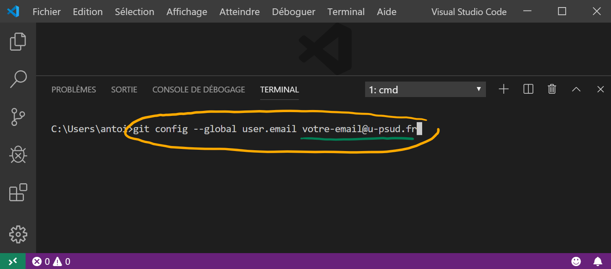

# Projet Robot

Dépôt pour les cours de Projet Robot à l'IUT de Cachan

## Règles à respecter

* Avant de démarrer un __projet Mbed__, vous devez avoir un __clone local__ de votre
repo.
* Chaque fichier `.h` (ou `.hpp`) créé doit être placé dans le dossier `include`.
* Chaque fichier `.c`(ou `.cpp`) créé doit être placé dans le dossier `src`.

## Par où commencer

### Comment cloner localement votre repo

* Récupérér le lien de votre repo :
    * Cliquer sur le bouton vert __Clone or download__ et copier l'URL

* Cloner avec __Visual Studio Code__ :
    * Ouvrir Visual Studio Code
    * Appuyer sur `F1`, ensuite taper `clone`, choisissez `Git: Clone`
    * Coller l'URL dans le champ demandé
    * Sauvegarder quelque part (à l'IUT, ce sera dans votre dossier qui est
    dans `C:\Travail`)
    * Cliquer sur `Open Repository`


### Branches, Commits, et Synchronisation
Pas d'explications, il faut pratiquer !

### À la maison (si vous avez Windows)

Vous devez installer les logiciels qui vous seront utiles pour travailler à
la maison. Dans l'ordre, installer :
* [Git](https://www.git-scm.com/download)
* [Visual Studio Code](https://code.visualstudio.com/download)
    * __Attention :__ choisir la version `User Installer - 64 bit`
* [CMake](https://cmake.org/download/)
    * __Attention :__ chercher `Windows win64-x64 Installer`
* [Driver ST Link](https://www.st.com/en/development-tools/stsw-link009.html)
* [7-Zip](https://www.7-zip.org)
    * __Attention :__ choisir la version `64-bit x64`
* [OpenOCD](http://gnutoolchains.com/arm-eabi/openocd/)
    * __Attention :__ en utilisant 7-Zip, décompresser le contenu dans `C:\OpenOCD`
* [Gnu ARM Embedded Toolchain](https://developer.arm.com/open-source/gnu-toolchain/gnu-rm/downloads)
    * __Attention :__ Choisir la version `major-win32.exe`
    * __Attention :__ Accepter d'ajouter les éléments dans la variable d'environnement `Path`
* [Ninja](https://github.com/ninja-build/ninja/releases)
    * __Attention :__ Choisir la version `ninja-win.zip`
    * __Attention :__ Décompresser le contenu dans
    `C:\Ninja`

#### Modification des variables d'environnement sous Windows
* Taper _variables d'environnement_ sur le bouton _Démarrer_ puis
cliquer sur `Modifier les variables d'environnement système`
* Cliquer sur le bouton `Variables d'environnement ...`
* Dans le champ **_Variables système_**, sélectionner la variable `Path` puis
cliquer sur `Modifier ...`
    * Ajouter le chemin vers _OpenOCD_ (par exemple : `C:\OpenOCD\bin`) en
    cliquant successivement sur `Nouveau` et sur `Parcourir ...`
    * De même, ajouter le chemin vers _Ninja_ (par exemple : `C:\Ninja`)
     en recliquant successivement sur `Nouveau` et sur `Parcourir ...`
* Cliquer `OK`

### À la maison (si vous avez Mac OS X)

* Vous devez installer les logiciels qui vous seront utiles pour travailler à
la maison. Dans l'ordre, installer :
    * [XCode](https://apps.apple.com/fr/app/xcode/id497799835?mt=12)
    * [Git](https://www.git-scm.com/download)
    * [Visual Studio Code](https://code.visualstudio.com/download)
    * [Macports](https://www.macports.org/install.php)
    * [Gnu ARM Embedded Toolchain](https://developer.arm.com/open-source/gnu-toolchain/gnu-rm/downloads)
        * Déplacer le dossier décompressé dans `/Users/votre-login`

* Ouvrir un _Terminal_ et tapez les commandes suivantes
    * Attention : il faudra régulièrement confirmer les installations en tapant `Y` puis `Entrée`
```bash
sudo port selfupdate
sudo port install openocd cmake ninja
```

#### Modification des variables d'environnement sous Mac
* Editer le chemin vers _Gnu ARM Embedded Toolchain_
en tapant la commande suivante:
```bash
nano ~/.profile
```
* Puis avec _nano_, ajouter la ligne suivante dans le fichier `.profile`
```bash
export PATH=/Users/votre-login/gcc-arm-none-eabi-8-2019-q3-update/bin:${PATH}
```

### À la maison (si vous avez Linux)

* Vous devez installer les logiciels qui vous seront utiles pour travailler à
la maison. Dans l'ordre, installer :
    * [Git](https://www.git-scm.com/download)
    * [Visual Studio Code](https://code.visualstudio.com/download)
        * Installer en ouvrant un _Terminal_ et en tapant par exemple la commande
```bash
sudo dpkg -i code_1.36.1-1562627527_amd64.deb
```

* Ouvrir un _Terminal_ et tapez les commandes suivantes
```bash
sudo apt update
sudo apt -y install gcc-arm-none-eabi openocd cmake ninja-build
```

### Installation des extensions dans _Visual Studio Code_
* Ouvrir _Visual Studio Code_
* Cloner votre repo
* Accepter toutes les requêtes d'installation d'extensions de
_Visual Studio Code_

### Paramétrage du versionning dans _Visual Studio Code_
* Ouvrir _Visual Studio Code_
* Suivre les captures d'écran ci-dessous pour paramétrer vos
identifiants sur _Visual Studio Code_
<br /><br />
<br /><br />
<br /><br />
